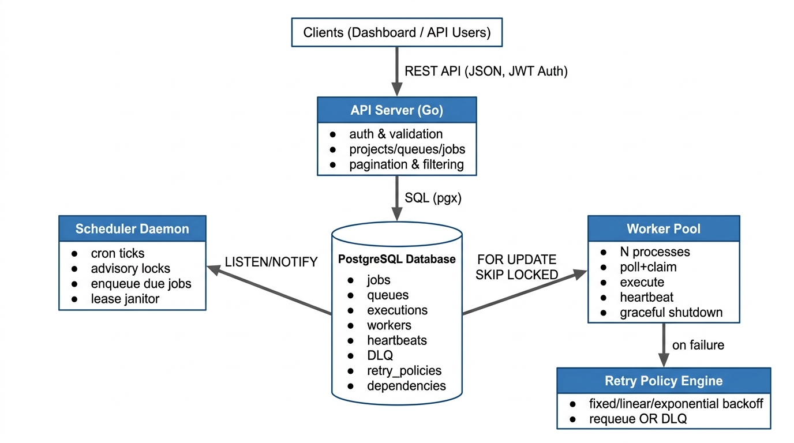
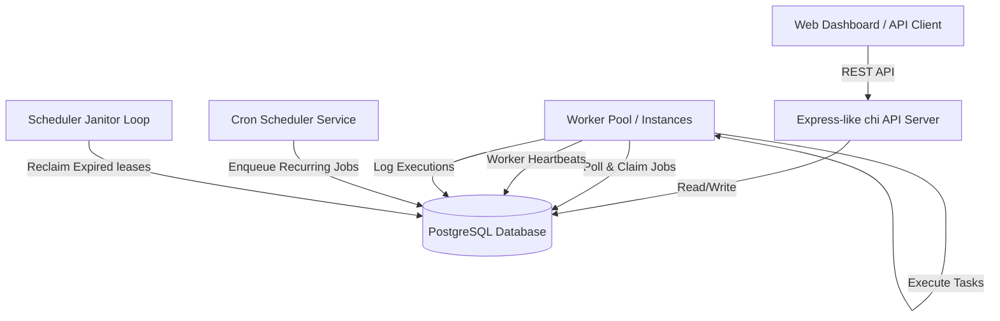
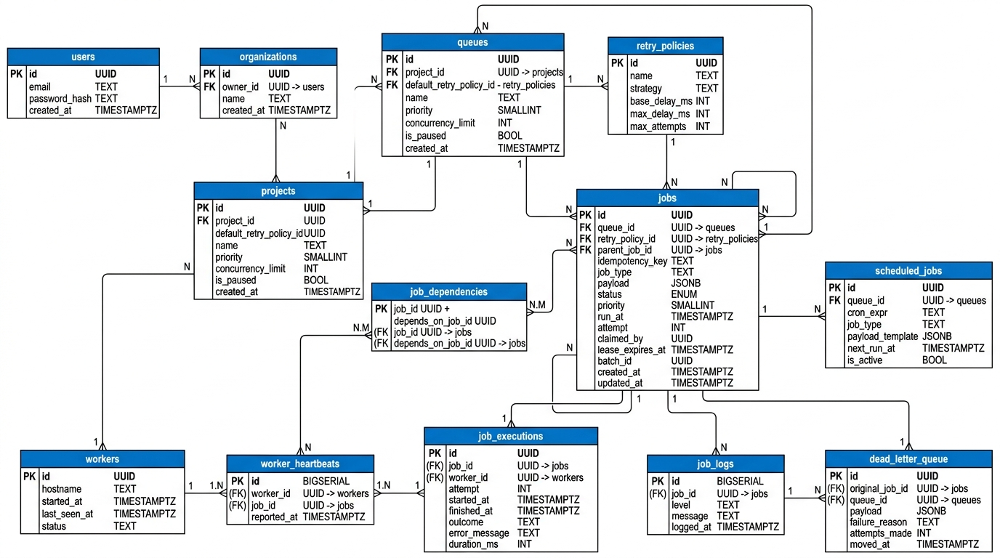
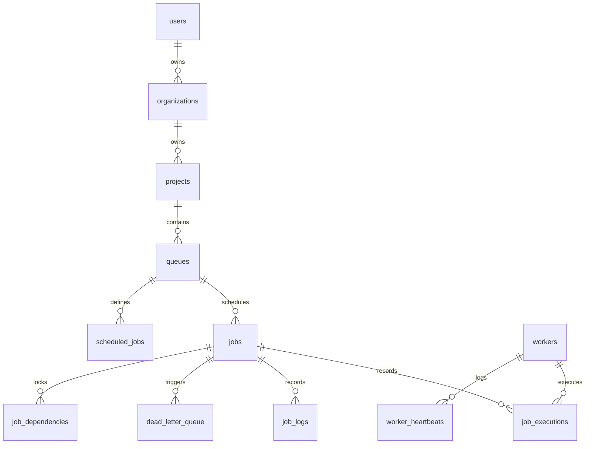

# Obsidian — Distributed Job Scheduling Platform

Obsidian is a highly reliable, production-inspired distributed background job scheduling and execution engine. It is built in **Go** for maximum concurrency, utilizes **PostgreSQL** for atomic locking guarantees, and provides a premium **React-based dashboard** for queue management and system observability.

---

## Key Core Invariants

1.  **Atomic Job Claims via `FOR UPDATE SKIP LOCKED`**: Obsidian uses row-level locking to ensure that multiple workers polling the same database queue never double-claim or execute the same job concurrently.
2.  **HA Cron Scheduling via Advisory Locks**: Rather than using external state managers (like Redis), Obsidian secures cron-dispatch scheduling ticks across multiple scheduler nodes using PostgreSQL advisory locks per queue.
3.  **Heartbeat Lease Recovery**: Active worker nodes send periodic heartbeats. If a worker node crashes mid-execution, its lease expires, and the scheduler auto-reclaims the task, returning it to the queue for at-least-once execution.
4.  **DAG Dependency Resolution**: Enforce job ordering where dependent jobs are held back until parent jobs flip to the `completed` state.

---

## System Architecture





---

## Database ER Diagram





---

## Setup & Installation

### Prerequisites
- Go 1.22+
- Node.js 20+
- Docker & Docker Compose

### 1. Spin Up PostgreSQL
Use docker-compose to start the Postgres container:
```bash
make db-up
```

### 2. Database Migrations
Deploy the database schema:
```bash
# Connect to PostgreSQL and apply the schema:
PGPASSWORD=obsidian psql -h localhost -U postgres -d obsidian -f internal/db/migrations/001_init.sql
```

### 3. Run Backend Services
Start the REST API, worker daemon, and cron scheduler in separate terminal windows:
```bash
# Start HTTP API on port :8080
make run-api

# Start Scheduler Daemon (Cron dispatcher + Lease Janitor)
make run-scheduler

# Start Worker Node (Polls and runs jobs)
make run-worker
```

### 4. Run React Dashboard
Start the Vite development server:
```bash
make run-dashboard
```
Open `http://localhost:5173` to access the dashboard.

---

## Testing & Verification

### Run Unit Tests
Run the Go test suites covering backoff delay logic:
```bash
make test
```

### Run Chaos Recovery Demo
To verify Obsidian's crash recovery under failure, run the automated chaos script. It enqueues a long-running job, launches a worker, kills the worker mid-execution, and asserts that the scheduler janitor reclaims the job and schedules a retry:
```bash
make chaos-demo
```
- Recorded execution proof log: [Chaos Recovery Log](docs/chaos-demo-output.log)

### Load Testing
Execute the `k6` throughput test script against a running queue (requires [k6](https://k6.io/)):
```bash
k6 run load-test/k6-claim-throughput.js --env API_URL=http://localhost:8080 --env QUEUE_ID=<your-queue-id>
```
- Benchmark metrics & report: [Load Test Results](docs/load-test-results.md)

---

## Project Documentation
- Detailed design trade-offs, SKIP LOCKED, and heartbeats: [Design Decisions](file:///Users/adeshkishordeshmukh/Documents/Hackthons/College_AdiQuity/Obsidien/docs/design-decisions.md)
- Complete endpoint spec sheets: [API Documentation](file:///Users/adeshkishordeshmukh/Documents/Hackthons/College_AdiQuity/Obsidien/docs/api-spec.md)
- Postman API Collection: [Postman Collection](file:///Users/adeshkishordeshmukh/Documents/Hackthons/College_AdiQuity/Obsidien/docs/postman-collection.json)
