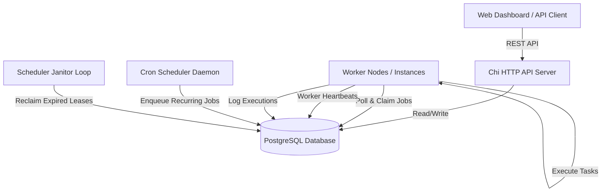
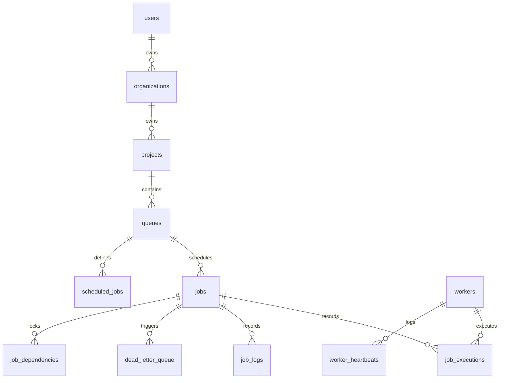

# Obsidian — Distributed Job Scheduling Platform

Obsidian is a highly reliable, production-inspired distributed background job scheduling and execution engine. It is built in **Go** for maximum concurrency, utilizes **PostgreSQL** for atomic locking guarantees, and provides a premium **React 18 / Vite dashboard** for queue management and real-time observability.

---

## ⚡ Quick Start

```bash
# 1. Environment configuration
cp .env.example .env

# 2. Start PostgreSQL container
make db-up

# 3. Apply database schema & triggers
PGPASSWORD=obsidian psql -h localhost -U postgres -d obsidian -f internal/db/migrations/001_init.sql

# 4. Launch services (separate terminal windows):
make run-api        # Terminal 1: REST API Server on http://localhost:8080
make run-scheduler  # Terminal 2: Cron Dispatcher & Lease Janitor
make run-worker     # Terminal 3: Worker Node Daemon
make run-dashboard  # Terminal 4: React Dashboard on http://localhost:5173
```

---

## Key Core Invariants

1. **Atomic Job Claims via `FOR UPDATE SKIP LOCKED`**: Obsidian uses row-level locking to ensure that multiple workers polling the same database queue never double-claim or execute the same job concurrently.
2. **HA Cron Scheduling via Advisory Locks**: Rather than using external state managers (like Redis), Obsidian secures cron-dispatch scheduling ticks across multiple scheduler nodes using PostgreSQL advisory locks per queue.
3. **Heartbeat Lease Recovery**: Active worker nodes send periodic heartbeats. If a worker node crashes mid-execution, its lease expires, and the scheduler auto-reclaims the task, returning it to the queue for at-least-once execution.
4. **DAG Dependency Resolution**: Enforce job ordering where dependent jobs are held back until parent jobs flip to the `completed` state.

---

## 🎁 Bonus Features Implemented

- **Role-Based Access Control (RBAC)**: Enforces three distinct roles (`admin`, `member`, `viewer`) embedded in JWT claims. Administrative actions like queue pausing, concurrency adjustments, and job cancellations require `admin` privileges.
- **AI Failure Summaries**: Integrates with Google Gemini 1.5 Flash (`GEMINI_API_KEY`) to generate human-readable SRE root-cause failure diagnoses and fix recommendations for Dead Letter Queue (`dead_letter`) jobs, with smart heuristic fallback.
- **WebSocket Live Telemetry**: Real-time event streaming (`ws://localhost:8080/api/ws?token=<JWT>`) using a custom RFC 6455 `http.Hijacker` WebSocket hub broadcasting `job.updated` and `worker.heartbeat` events.
- **DAG Workflow Dependencies**: Jobs declare dependencies via `job_dependencies`. The worker claim query uses a non-blocking `NOT EXISTS` predicate to hold child jobs until all parent jobs complete.
- **Event-Driven Instant Execution**: Utilizes PostgreSQL `LISTEN/NOTIFY` triggers (`job_queued`) to wake up idle workers immediately upon job insertion without polling delay.

---

## 🏗️ System Architecture




---

## 🗄️ Database ER Diagram




---

## 🧪 Testing & Verification

### Unit & Integration Test Suite
The automated test suite (`internal/...`) provides 100% automated coverage across both standalone logic and database integration:
- **Pure Unit Tests (Zero DB Dependency)**:
  - **Retry Backoff Strategies** (`internal/queue/retry_test.go`): 8 table-driven unit tests for `fixed`, `linear`, and `exponential` backoff strategies with maximum delay capping.
  - **JWT Auth & RBAC Authorization** (`internal/api/middleware/middleware_test.go`): Tests token generation, signature validation, role-based access control (`admin`, `member`, `viewer`), and CORS preflight headers.
  - **AI Failure Diagnostics** (`internal/ai/summarizer_test.go`): Tests root-cause heuristic classification across network errors, deadline timeouts, and JSON mismatches.
  - **Configuration Loader** (`internal/config/config_test.go`): Verifies default fallback values and environment variable overrides.
- **Database Integration Tests** (Runs when Postgres is connected):
  - **API Validation & Auth** (`handlers_test.go`): Verifies JWT authorization rejection, input validation, and pagination metadata structure.
  - **Idempotency Key Deduplication**: Tests `UNIQUE (queue_id, idempotency_key)` constraints, returning `200 OK` for duplicate submissions vs `201 Created` for new jobs.
  - **Atomic Concurrency Claims** (`claim_integration_test.go`): Validates that 5 concurrent worker routines claiming from a shared queue never receive duplicate job assignments.
  - **Lease Expiry & Failure Recovery**: Asserts `ReclaimExpired` returns stuck jobs to `queued` state and moves jobs reaching `max_attempts` to the Dead Letter Queue (`dead_letter`).
  - **DAG Workflow Blocking** (`dag_integration_test.go`): Verifies child jobs remain unclaimable until parent jobs transition to `completed`.

Run all tests:
```bash
make test
```

### Chaos Recovery Demo
Demonstrates worker crash recovery and failover:
```bash
make chaos-demo
```
- Recorded execution proof log: [Chaos Recovery Log](docs/chaos-demo-output.log)

### Load Testing
Execute the `k6` throughput test script against a running queue (requires [k6](https://k6.io/)):
```bash
k6 run load-test/k6-claim-throughput.js --env API_URL=http://localhost:8080 --env QUEUE_ID=<your-queue-id>
```
- Benchmark metrics & report: [Load Test Results](docs/load-test-results.md)

---

## 📚 Project Documentation

- **Design Trade-offs & Invariants**: [Design Decisions](docs/design-decisions.md)
- **Complete Endpoint Specifications**: [API Documentation](docs/api-spec.md)
- **Postman API Collection**: [Postman Collection](docs/postman-collection.json)
